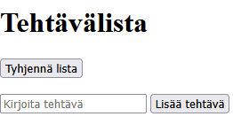

# :spiral_notepad: Tehtävälista (JavaScript DOM -harjoitus)


## 📸 Esikatselu



## 🔗 Live Demo

👉 https://thermopylai.github.io/todo-list/tehtavalista.html

---

## 📖 Kuvaus

Yksinkertainen selainpohjainen **tehtävälistasovellus**, jonka tarkoituksena on harjoitella **JavaScriptin DOM-manipulaatiota** sekä tapahtumankäsittelyä.

Sovelluksessa käyttäjä voi lisätä tehtäviä listaan, merkitä ne valmiiksi sekä poistaa niitä. Lista päivittyy dynaamisesti JavaScriptin avulla ilman sivun uudelleenlatausta.

Projektin toteutus on tarkoituksella pidetty yksinkertaisena, jotta perusperiaatteet ovat helposti ymmärrettävissä.

---

## :hammer_and_wrench: Ominaisuudet

- Uusien tehtävien lisääminen listaan
- Tehtävän merkitseminen valmiiksi (yliviivattu teksti)
- Tehtävän poistaminen
- Koko listan tyhjentäminen
- Tehtävän lisääminen myös **Enter-näppäimellä**
- Syötteen validointi (tyhjää tehtävää ei voi lisätä)

---

## :gear: Käytetyt teknologiat

- **HTML**
- **JavaScript**
- **DOM API**

JavaScript käyttää muun muassa seuraavia DOM-toimintoja:

- `document.getElementById()`
- `createElement()`
- `appendChild()`
- `addEventListener()`
- `innerHTML`

---

## :file_folder: Projektin rakenne

```text
tehtavalista/
│
├── tehtavalista.html
└── README.md
```

Sovellus on toteutettu yhdessä HTML-tiedostossa, jossa JavaScript-koodi sijaitsee `<script>`-tagin sisällä.

---

## :wrench: Käyttö

1. Lataa projekti tai kloonaa repository:

```text
git clone https://github.com/USERNAME/tehtavalista.git
```

2. Avaa tiedosto selaimessa:

```text
tehtavalista.html
```

3. Lisää tehtäviä kirjoittamalla tekstikenttään ja painamalla **Lisää tehtävä.**

---

## :muscle: Mitä projektissa harjoitellaan

Projektin tavoitteena on harjoitella JavaScriptin keskeisiä perusteita:
- DOM-elementtien luonti ja muokkaus
- tapahtumankäsittely (`click`, `keydown`)
- taulukon käyttö sovelluksen tilan tallentamiseen
- yksinkertainen tilanhallinta (`valmis`-status)
- dynaaminen käyttöliittymän päivitys

---

## :rocket: Mahdollisia jatkokehitysideoita

- tehtävien tallennus **LocalStorageen**
- tehtävien järjestäminen
- prioriteetit
- käyttöliittymän parantaminen (esim. **Bootstrap**)
- tehtävien muokkaaminen

---

## 👤 Tekijä

**Lauri Tikkanen**

GitHub: [Thermopylai](https://github.com/Thermopylai)